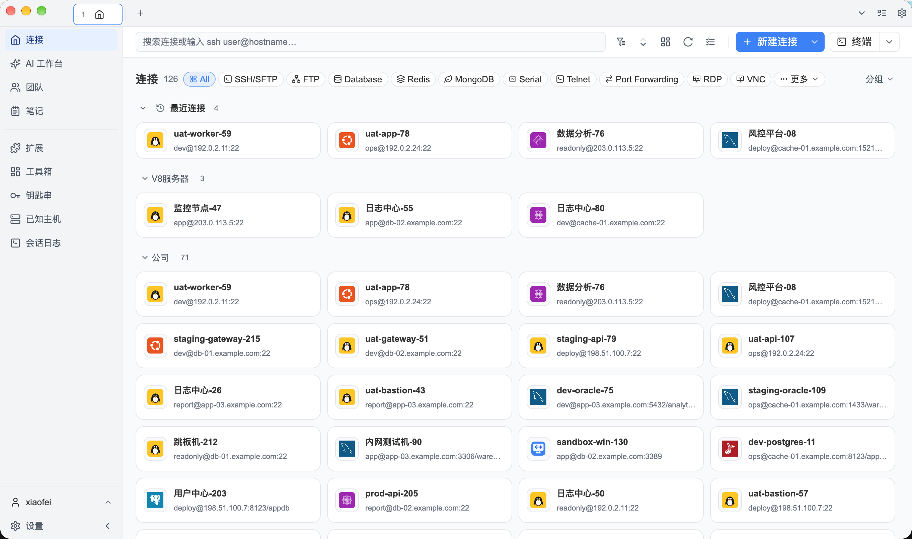

<div align="center">
  <p></p>
  <h1>Navop</h1>
  <p><strong>数据库、SSH、SFTP、终端、远程桌面、监控与 AI 一体化的原生桌面工作台。</strong></p>
  <p>基于 <a href="https://gpui.rs">GPUI</a> 与 Rust 构建 · GPU 加速渲染 · 无 WebView</p>

  <p>
    <a href="https://github.com/feigeCode/navop/releases"></a>
    <a href="https://github.com/feigeCode/navop/actions/workflows/ci.yml"></a>
    <a href="#许可证"></a>
    <a href="https://qm.qq.com/cgi-bin/qm/qr?k=&group_code=860670605"></a>
    <a href="https://docs.qq.com/doc/DVEFFd2RnSnJLcFBD"></a>
  </p>

  <p>
    
    
    
    
    
    
    
    
    
    
    
    
    
    
    
    
    
    
    
    
    
    
  </p>

  <p>
    <a href="README.md">English</a> ·
    <a href="https://docs.navop.dev/">使用文档</a> ·
    <a href="#功能特性">功能特性</a> ·
    <a href="#应用截图">应用截图</a> ·
    <a href="#安装">安装</a> ·
    <a href="https://github.com/feigeCode/navop/releases/latest">最新版本</a> ·
    <a href="CONTRIBUTING.md">参与贡献</a>
  </p>

  <p></p>
</div>

## 功能特性

### 数据库与数据工具

- 内置支持 MySQL、PostgreSQL、SQLite、DuckDB、SQL Server、Oracle、ClickHouse；TDengine 改为可安装的扩展驱动，与达梦 DM、金仓 KingbaseES、GBase 8s、OceanBase、openGauss、Apache IoTDB 和神通 Oscar 驱动一同通过扩展市场安装。
- 浏览数据库对象，编辑和执行 SQL 并查看执行计划，导入导出数据，比较 Schema/Data，并通过 ER 图查看关系。
- 专用的 Redis 与 MongoDB 界面；MQTT 等中间件连接改为通过扩展市场安装的扩展提供（MQTT 3.1.1 + rustls 加密，支持 SSH 隧道与断线自动重订阅），提供订阅、消息、发布三个视图。
- 表数据页签支持批量编辑选中单元格，日期/时间/数值列使用对应的类型化编辑控件，支持右键复制表名与字段名。

### 远程连接与运维

- 可拖拽分屏的 SSH 与本地终端，支持快捷命令、广播输入、Shell integration、会话锁定、会话录制回放；会话日志支持搜索、批量删除与增量加载；同时支持 Telnet 与串口连接。
- 通过 SFTP 上传下载、搜索、收藏、远程编辑（可配置大小上限与默认编辑器）、拖拽传输、ZMODEM 传输和跨服务器复制管理远程文件。
- 可复用的本地、远程（`ssh -R`）与动态 SOCKS 端口转发；X11 转发；主机密钥变更指纹确认；「已知主机」页面可查看、导入和移除信任的 SSH 主机密钥；可按连接启用旧版 SSH 算法。
- 导入 SecureCRT 等外部工具的会话，进行服务器监控，并支持 RDP/VNC 远程桌面。Windows 上集成原生 MSTSC：通过 C++ 宿主将微软 RDP ActiveX 控件直接内嵌到应用中，可在页签内、全屏窗口中连接，也可一键启动原生 `mstsc.exe` 客户端；跨平台则由纯 Rust 的 IronRDP canvas 后端渲染 RDP 会话。

### 编辑、AI 与扩展

- 本地 Markdown 笔记，支持 Mermaid 图、数学公式，并可导出为 HTML、PDF 或 DOCX；内置编辑器支持保存快捷键与 WASM 语言解析器语法高亮。
- 使用 AI 生成和解释 SQL、分析数据、生成图表、辅助终端操作、调用工具和运行 Agent 工作流；通过 ACP 接入 Codex、Claude Code 和 OpenCode 等外部 Agent。
- Agent Hub 在同一工作区查看终端 Agent、项目文件、Git 分支、变更列表和并排 Diff；工具箱聚合扩展小工具并与连接扩展区分。
- 扩展市场提供数据库驱动、远程桌面 provider、文档渲染器、连接导入器和外部编辑器。官方扩展在 [navop-extensions](https://github.com/feigeCode/navop-extensions) 仓库独立构建发布。
- 快速打开支持临时 SSH 连接，标签栏提供新建连接入口，临时会话无需先保存连接。

### 原生桌面体验

- 基于 GPUI 的原生界面与 GPU 加速渲染；亮色、深色、跟随系统模式，可导入主题，并配置强调色和窗口透明度。
- 主页统一网格布局与树形视图，最近连接、批量连接管理，工作区拖拽排序持久化。
- 设置页按数据库、终端、Agent、MCP 拆分为独立分页；快捷键支持清除与禁用系统快捷键。
- 支持 English、简体中文和繁体中文界面。
- 加密同步不同设备上的个人连接、凭据与设置。

## Public MCP、Navop CLI 与 Agent Skill

Navop 可将选定的宿主权威工具开放给外部 Codex、Claude、MCP 客户端和自动化程序。请在 **设置 > 通用 > MCP > MCP Server** 中开启服务、选择权限档位（安全 / 确认 / 自动），并在 **Tool Exposure** 中只启用需要的工具组。runtime 只监听动态 loopback 端口，并使用用户专属 discovery token 验证客户端；实时工具、Schema、权限、审批和审计始终由正在运行的 Navop 控制。

终端型 Agent 需要安装 [`@navop/cli`](https://github.com/feigeCode/navop-mcp) 及其内置的 Navop Skill：

```bash
npm install -g @navop/cli@latest

# 为 Codex 安装 Skill；Agents 兼容客户端可改用 --target agents
navop skill install --target codex --scope user
```

独立的 [`@navop/mcp`](https://github.com/feigeCode/navop-mcp) 仅用于为原生 MCP 客户端提供 stdio bridge（`npx -y @navop/mcp@latest`）。完整命令参考和客户端配置请查看 [Navop MCP 与 CLI 仓库](https://github.com/feigeCode/navop-mcp)与 [Public MCP 使用指南](https://docs.navop.dev/guide/public-mcp)。

## 应用截图

| 工作台总览 |
|:-:|
| [](app1.png) |

| 数据库 | SSH |
|:-:|:-:|
| [](database.png) | [](ssh.png) |

| SFTP | Redis |
|:-:|:-:|
| [](sftp.png) | [](redis.png) |

| MongoDB |                AI 对话                 |
|:-:|:------------------------------------:|
| [](mongodb.png) | [](ai_chat.png) |

| Agent Hub | 扩展市场 |
|:-:|:-:|
| [](agent_hub.png) | [](extension.png) |

| 远程文件编辑 | ER 图 |
|:-:|:-:|
| [](remote_file_editor.png) | [](er.png) |

| 服务器监控 | 主题 |
|:-:|:-:|
| [](monitor.png) | [](theme.png) |

## 安装

请从 [GitHub Releases](https://github.com/feigeCode/navop/releases/latest) 下载最新版本。每个版本都包含用于校验文件的 `sha256sums.txt`。安装包覆盖 macOS（DMG 与 tar.gz，Apple Silicon / Intel）、Windows（MSI 与 EXE 安装版，以及普通与便携 ZIP）和 Linux（tar.gz、deb、rpm、AppImage），命名遵循 `navop-<version>-<平台>-<架构>.<扩展名>` 规则。

如果 macOS 提示“Apple 无法检查其是否包含恶意软件”，请执行 `sudo xattr -rd com.apple.quarantine /Applications/Navop.app`。

Windows 用户也可以通过 [Scoop](https://scoop.sh) 安装（使用便携版包，数据持久化由 Scoop 管理）：

```powershell
scoop bucket add extras
scoop install navop
```

Navop 也已在 [FlatPark](https://flatpark.org/zh-Hans/apps/dev.navop.Navop/) 上架社区 Flatpak 软件包：

```bash
flatpak --user remote-add --if-not-exists flatpark https://dl.flatpark.org/flatpark.flatpakrepo
flatpak --user install flatpark dev.navop.Navop
```

完整的安装包选择表、Windows 便携模式说明、v0.10.1 及更早版本 ZIP 的升级迁移，以及 Oracle Instant Client / 纯 Go 驱动说明，请参阅[安装与更新指南](https://docs.navop.dev/guide/install-update)。

## 从源码构建

Navop 使用 Rust 2024 edition，并需要安装各平台的系统依赖。

```bash
# 安装 Linux 依赖
./script/bootstrap

# 运行应用
cargo run -p main
```

Windows 请在 PowerShell 中安装依赖：

```powershell
.\script\install-window.ps1
```

常用开发检查：

```bash
cargo build
cargo test --all
cargo clippy --workspace --all-targets
cargo fmt --check
```

完整开发指南请参阅 [CONTRIBUTING.md](CONTRIBUTING.md)。

## 社区与支持

Navop 由个人长期维护。Star、聚焦的小型 PR、Bug 报告和捐赠都有助于项目持续发展。

- [反馈 Bug 或提出功能建议](https://github.com/feigeCode/navop/issues)
- QQ 群：[860670605](https://qm.qq.com/cgi-bin/qm/qr?k=&group_code=860670605)
- 微信群：[加入](https://docs.qq.com/doc/DVEFFd2RnSnJLcFBD)
- 自愿捐赠：[DONATE_CN.md](DONATE_CN.md)
- 旧版 OnetCli 仓库：[feigeCode/onetcli](https://github.com/feigeCode/onetcli)

## Star History

<a href="https://star-history.dera.page/#feigeCode/navop&type=date&logscale=&legend=top-left">
 <picture>
   <source media="(prefers-color-scheme: dark)" srcset="https://star-history.dera.page/svg?repos=feigeCode/navop&type=date&theme=dark&logscale&legend=top-left" />
   <source media="(prefers-color-scheme: light)" srcset="https://star-history.dera.page/svg?repos=feigeCode/navop&type=date&logscale&legend=top-left" />
   
 </picture>
</a>

## 致谢

ER 图渲染基于 [ferrum-flow](https://github.com/tu6ge/ferrum-flow.git)。

## 许可证

Navop 源代码基于 [Apache License 2.0](LICENSE-APACHE) 开源。Navop 自有代码还须遵守 [Navop 补充协议](NAVOP_LICENSE)，该协议允许通过免费分发渠道（如 GitHub Releases、Flatpak 仓库和免费应用商店）免费分发，但禁止商业转售、收取费用、竞争性产品或服务以及付费分发平台。第三方组件继续适用其各自的许可证。

如有许可证与版权相关问题，请联系 xiaofei.hf@gmail.com。
